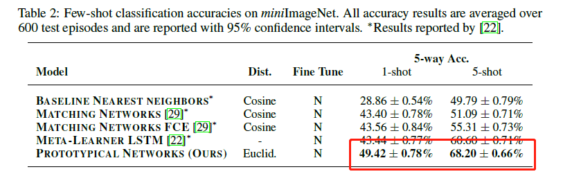

# 使用PaddlePaddle复现论文：Prototypical Networks for Few-shot Learning
本文参照(https://github.com/yinboc/prototypical-network-pytorch)的pytorch版本进行复现

## Prototypical Networks

[Prototypical Networks for Few-shot Learning](https://dl.acm.org/doi/abs/10.5555/3294996.3295163)

**摘要：**
我们提出了原型网络来解决小样本分类问题：分类器能够通过很少的几个在测试集上未出现新的类别的样本来获得在训练集上未出现过的新的类别的分类能力。
原型网络学习一个度量空间，在这个度量空间中，计算到每个类别的原型表征的距离来进行分类。和最近的小样本学习方法相比，它们体现出了一种更简单的归纳偏差，这种归纳偏差在有限的数据集上是有益的，并且实现了优秀的性能。我们的分析指出，相比于最近涉及复杂架构选择和元学习的方法，一些简单的设计决策可以产生实质性的改进。我们进一步将原型网络扩展到零样本学习上，并在CU-Birds数据集上取得了SOTA的结果。

本项目是 prototypical Network 在 Paddle 2.1.2上的开源实现。

## 原论文效果
<p align="center">
    
</p>

## 环境安装

| 名称   | 值             |
|--------|------------------|
| python | 3\.7\.11        |
| GPU    | RTX3090          |
| 框架    | PaddlePaddle2\.1\.2 |
| Cuda   | 11\.2            |
| Cudnn  | 8\.2          |


```bash
# 克隆本仓库
git clone https://github.com/skingorz/prototypeNet-paddle.git
# 进入项目文件夹
cd prototypeNet-paddle
# 修改文件描述符限制
ulimit -n 20480
# 本地安装
conda env create -f environment.yml
```

## 快速开始

### （一）数据读取保存
数据集下载：[miniImageNet](https://www.jianguoyun.com/p/DYELLUUQzY7dCRiIuIUE)

为了避免训练过程中对文件的频繁读取，首先将数据集读取并保存到下来
```bash
python data/dataprocess.py
```

### （二）修改配置文件

`exps/exp-v1/config.yaml`为5way-1shot的配置文件，
`exps/exp-v2/config.yaml`为5way-5shot的配置文件，其中，需要将`datasets`值改为上一步生成的pkl所在路径

#### 参数说明
- `max_epoch` 训练epoch个数
- `save_epoch` 每隔多少个epoch保存一次模型
- `shot` 每个类别支持集的样本数
- `query` 每个类别查询集的样本上
- `train_way` 训练时每个episode包含的类别数
- `test_way` 测试时每个episode包含的类别数
- `datasets` 数据集，目前仅有mini-imageNet
- `datapath` 处理后的数据pkl所在目录
- `save_path` 模型保存路径
- `gpu` gpu选择
- `seed` 随机种子的设置
- `lr` 学习率
- `stepSize` 学习率衰减间隔
- `gamma` 衰减率
- `load` 加载模型的路径
- `result` 最终测试结果保存路径
- `batch` 测试时的episode数量

### （三）模型训练

#### 5-way-1-shot
[日志下载](https://www.jianguoyun.com/p/DVjtLAAQzY7dCRjqxIUE)
```bash
FLAGS_cudnn_deterministic=True python tools/train.py --config "exps/exp-v1/config.yaml"
```

#### 5-way-5-shot
[日志下载](https://www.jianguoyun.com/p/DfYfLzYQzY7dCRjsxIUE)
```bash
FLAGS_cudnn_deterministic=True python tools/train.py --config "exps/exp-v2/config.yaml"
```

### （四）性能测试

#### 5-way-1-shot

[模型下载](https://www.jianguoyun.com/p/DQmOizYQzY7dCRjexIUE)
[日志下载](https://www.jianguoyun.com/p/DRVCEBIQzY7dCRjmxIUE)

```bash
FLAGS_cudnn_deterministic=True python tools/test.py --config "exps/exp-v1/config.yaml"
```

#### 5-way-5-shot

[模型下载](https://www.jianguoyun.com/p/DddEm70QzY7dCRjfxIUE)
[日志下载](https://www.jianguoyun.com/p/DQf0OawQzY7dCRjuxIUE)

```bash
FLAGS_cudnn_deterministic=True python tools/test.py --config "exps/exp-v2/config.yaml"
```

### （五）性能对比

下表展示了我们的复现代码和paperwithcode上已有的结果对比，在5-way-1-shot上我们的方法超过了论文的性能0.87\%，也高于大部分复现结果。在5-way-5-shot上，我们比论文性能略低0.54%，但是paperwithcode上目前并无达到论文性能的代码，且我们的复现性能依旧高于大部分现有的复现结果。

| method   | 5-way-1-shot | 5-way-5-shot  |  
|:--------:|:------------:|:------------:|
| paper    | 49.42 ± 0.78 | 68.20 ± 0.66 |
| [oscarknagg/few-shot](https://github.com/oscarknagg/few-shot)  |  48.0  | 66.2 |
| [yinboc/prototypical-network-pytorch](https://github.com/yinboc/prototypical-network-pytorch)  |  49.1  | 66.9 |
| [schatty/prototypical-networks-tf](https://github.com/schatty/prototypical-networks-tf)  |  43.5  | 66.0 |
| [minseop-aitrics/FewshotLearning](https://github.com/minseop-aitrics/FewshotLearning) | 52.547 ± 0.766 | 67.673 ± 0.648 |
| [KamalM8/Few-Shot-learning-Fashion](https://github.com/KamalM8/Few-Shot-learning-Fashion)  |  48.0  | 66.2 |
| [WangTianduo/Prototypical-Networks](https://github.com/WangTianduo/Prototypical-Networks)  |  42.48  | 64.7 |
| [Michedev/Prototypical-Networks-Few-Zero-Shot](https://github.com/Michedev/Prototypical-Networks-Few-Zero-Shot)  |  49.75  | 66.60 |
| This repo(paddlepaddle)   | 50.29 ± 0.64 | 67.66 ± 0.49 |


# Reference

```bibtex
@inproceedings{snell2017prototypical,
  title={Prototypical networks for few-shot learning},
  author={Snell, Jake and Swersky, Kevin and Zemel, Richard},
  booktitle={Proceedings of the 31st International Conference on Neural Information Processing Systems},
  pages={4080--4090},
  year={2017}
}
```